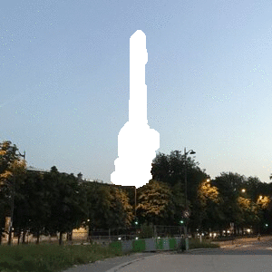

# Inpainting
This in an implementation of the article [Region Filling and Object Removal by Exemplar-Based Image Inpainting](https://www.irisa.fr/vista/Papers/2004_ip_criminisi.pdf) dealing with a patch-based method for image inpainting (replacing a part of the image by filling it in a coherent way). This project is part of the *Image processing* course at Télécom Paris (IMA201).

You can find full report of the projet [here](./Report/rapport%20final.pdf) (only in french).

<br/>

***

### Running the program
Place yourself in the "inpainting" directory, then execute :

```python Code/main.py -i [path/to/image] -m [path/to/mask] -o [path/to/output/image] ```

<br/>

By default, ```python Code/main.py``` will take *Image.png* and *Mask.png* in Data folder, and then save output image as *Output.png* in the same folder.

***
### Examples

<p float="center">
  
  
  
  
  
  
  
  
  
  
  
  
</p>

***
